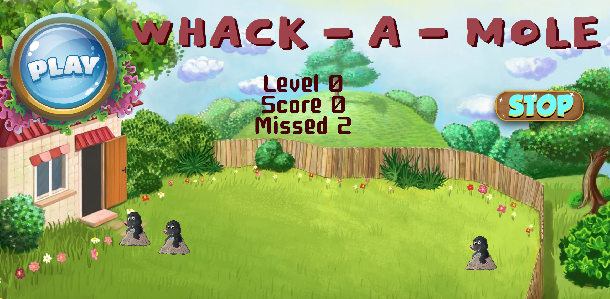

### Description

This is a variation of a Whack-A-Mole game. Whack-A-Mole is a popular arcade redemption game invented in 1976 by Aaron Fechter of Creative Engineering, Inc(Wikipedia). The game where you had to smash moles constantly coming out of their holes. 

### How to play

1.	Use Play button to start a game
2.	Use your left Mousbutton or click on touchpad to hit the Moles. 
3.	Hit as fast as you can and clear the grass from moles! They will appear faster and faster as levels progress.
4.	If you miss 5 moles the game is over, but you can press Play and play again.
5.	On the left side of a screen you can track your level, score, and moles missed

### Technology

 HTML, CSS, JavaScript

### Screenshot

